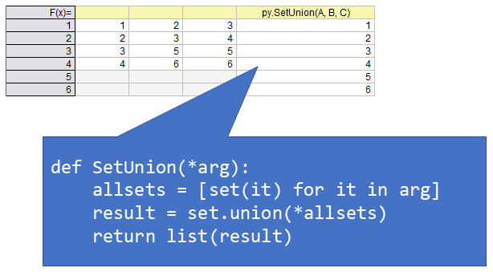
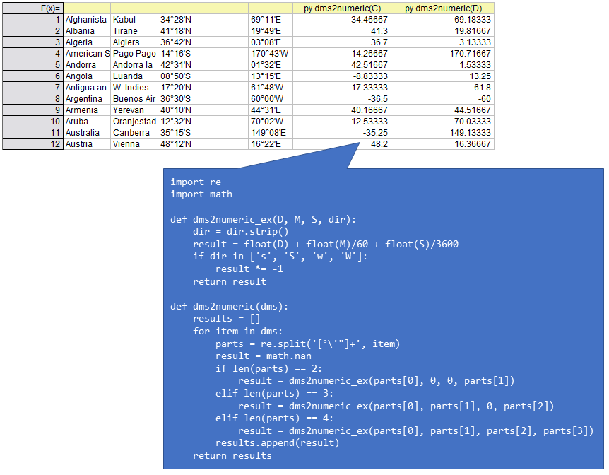

## Undocumented OriginPro
1. [Intersection of sets](#Intersection-of-sets)
1. [Union of sets](#Union-of-sets)
1. [Format DMS as numeric](#format-dms-as-numeric)

### Intersection of sets
```python
def SetIntersection(*arg):
    allsets = [set(it) for it in arg]
    result = set.intersection(*allsets)
    return list(result)
```


[Top](#undocumented-originpro)

### Union of sets
```python
def SetUnion(*arg):
    allsets = [set(it) for it in arg]
    result = set.union(*allsets)
    return list(result)
```


[Top](#undocumented-originpro)

### Format DMS as numeric
```python
import re
import math

def dms2numeric_ex(D, M, S, dir):
    dir = dir.strip()
    result = float(D) + float(M)/60 + float(S)/3600
    if dir in ['s', 'S', 'w', 'W']:
        result *= -1
    return result

def dms2numeric(dms):
    results = []
    for item in dms:
        parts = re.split('[°\'"]+', item)
        result = math.nan
        if len(parts) == 2:
            result = dms2numeric_ex(parts[0], 0, 0, parts[1])
        elif len(parts) == 3:
            result = dms2numeric_ex(parts[0], parts[1], 0, parts[2])
        elif len(parts) == 4:
            result = dms2numeric_ex(parts[0], parts[1], parts[2], parts[3])
        results.append(result)
    return results
```


[Top](#undocumented-originpro)
