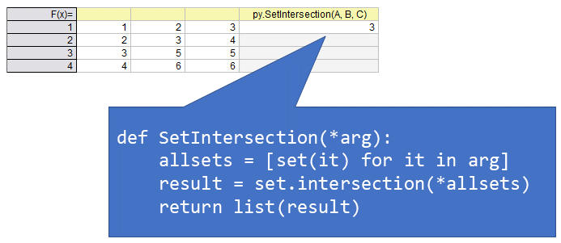

1. [Intersection of sets](#Intersection-of-sets)

### Intersection of sets
```python
def SetIntersection(*arg):
    allsets = [set(it) for it in arg]
    result = set.intersection(*allsets)
    return list(result)
```

